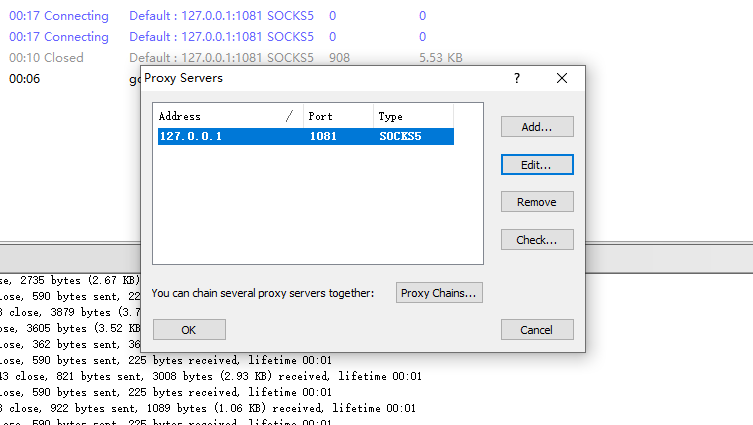
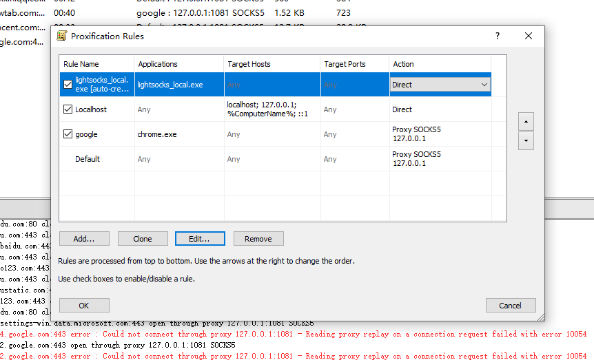

1，将lightsocks_server.exe以及.lightsocks.json上传到vdi放在同一个目录下，双击运行，然后打开win+r，输入cmd打开命令行，使用ipconfig查看主机的ip地址，比如：10.166.65.171

2，在本地将lightsocks_local.exe以及.lightsocks.json放在同一个目录下，修改.lightsocks.json的remote地址为第一步看到的ip地址+端口，如："remote": "10.166.65.171:1081",

> 此时算是已经成功安装了代理，但是windows系统不支持socket5代理，所以需要安装另一个Proxifier用于系统socket5的代理

3，安装Proxifier

- 添加Server

  

- 添加代理规则

  

成功上网，此时电脑就像是VDI一样可以访问网络